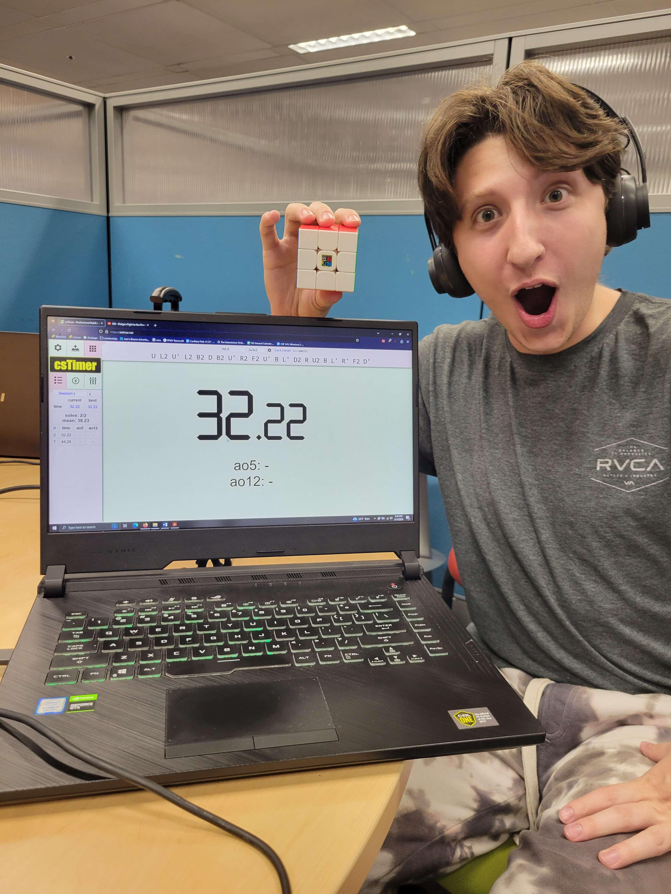

# Matthew Gross's Github User Page

## About My Experience
Hey I'm Matthew! I'm a 4th year computer engineering major and I have experience in the following languages:
1. C
2. C++
3. Java
4. MIPS Assembly
5. English
6. Python

One of my favorite algorithms is shown below. It's very intuitive!
```
# Python program for implementation of Bogo Sort (from geeksforgeeks)
import random
 
# Sorts array a[0..n-1] using Bogo sort
def bogoSort(a):
    n = len(a)
    while (is_sorted(a)== False):
        shuffle(a)
 
# To check if array is sorted or not
def is_sorted(a):
    n = len(a)
    for i in range(0, n-1):
        if (a[i] > a[i+1] ):
            return False
    return True
 
# To generate permutation of the array
def shuffle(a):
    n = len(a)
    for i in range (0,n):
        r = random.randint(0,n-1)
        a[i], a[r] = a[r], a[i]
 
# Driver code to test above
a = [3, 2, 4, 1, 0, 5]
bogoSort(a)
print("Sorted array :")
for i in range(len(a)):
    print ("%d" %a[i]),

```

## Even More About Me

I'm currently 21 years old (turning 22 in May!) and I can't wait to graduate! My main hobbies at the moment include:
- gaming
- cubing
- rock climbing
- listening to music
- playing clarinet
- watching movies 

Below you can see me reacting with glee at one of my PB's while cubing.



You should click this
[link](index.md)
while you're at it! It's very useful!

### Some Stuff I'd Like to Accomplish
- [x] Finish Lab 1
- [ ] Add a third item to this list...